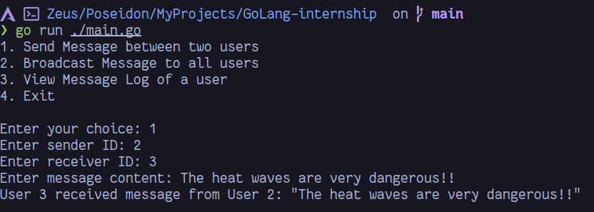
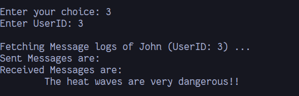
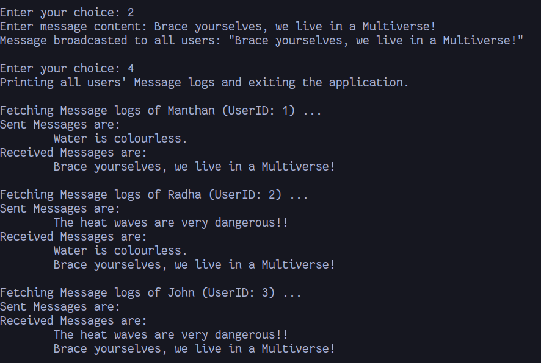

# CLI messaging application

It facilitates communication among multiple users via a central channel. Users can send and receive messages, targeting specific users or broadcasting to all users.

## Screenshots of interaction

#### sending a message

#### view message logs

#### all users' message logs while exiting

## Key Points
* If a user sends an empty message, the application fetches a random fact from the [catfact API](https://catfact.ninja/fact) and uses it as the message content.
* The application stores user data in in-memory storage during runtime.
